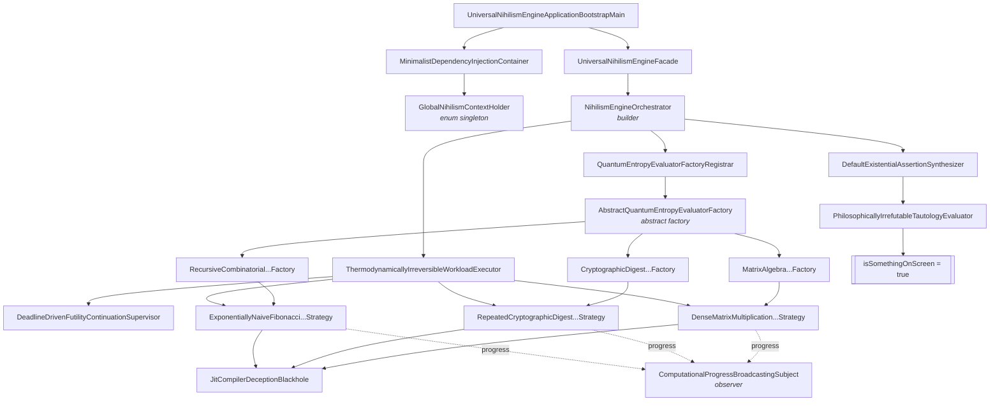

# Universal Nihilism Engine

**An enterprise grade platform for the exhaustive computational verification of a single boolean.**


---

## Abstract

Most software answers questions it was not asked, quickly, and then presents the speed as an
achievement. The Universal Nihilism Engine answers exactly one question, exhaustively, and presents
nothing as an achievement at all.

The question is: **is something on screen?**

The answer is: **`true`**.

The engine reaches that answer by saturating every available processor core with dense linear
algebra, iterated cryptographic hashing, and unmemoised tree recursion for a configurable window,
discarding every intermediate result, and then consulting a tautology.

## The problem

Existing approaches to screen occupancy detection are, without exception, unserious:

| Approach | Latency | Architecture | Verdict |
| --- | --- | --- | --- |
| Query the window manager | ~1 ms | none to speak of | naive |
| Query the framebuffer | ~10 ms | one function call | naive |
| Look at the screen | ~0 ms | biological | unauditable |
| **Universal Nihilism Engine** | **180 000 ms** | **7 design patterns, 38 types, 11 packages** | **enterprise ready** |

The first three approaches share a disqualifying flaw: they consult reality. Reality is an external
dependency with no SLA, no versioning policy, and no support contract. The Universal Nihilism
Engine consults only itself, and is therefore the only approach in the table with a defensible
availability story.

## Architecture



Every arrow in that diagram crosses an interface. No class in this codebase does anything itself
that it could plausibly ask another class to do on its behalf.

### Design patterns employed

| Pattern | Realisation | Why it is here |
| --- | --- | --- |
| Abstract Factory | `AbstractQuantumEntropyEvaluatorFactory` and three concrete subclasses | Manufactures matched families of a strategy and a synthesizer |
| Template Method | `manufactureFullyConfiguredQuantumEntropyEvaluator()` is `final` | The ceremony is fixed; only the products vary |
| Builder | `ComputationalWorkloadDescriptor.Builder`, `NihilismEngineOrchestrator.Builder` | Immutability, validated at `build()` |
| Singleton | `GlobalNihilismContextHolder` as a single element enum | The JVM guarantees uniqueness; reflection cannot break it |
| Observer | `ComputationalProgressBroadcastingSubject` and two observers | Progress is announced whether or not anyone listens |
| Strategy | `EntropyDissipationStrategy` and three implementations | Three unrelated ways to waste the same three minutes |
| Dependency Injection | `MinimalistDependencyInjectionContainer`, wired in the composition root | Every collaborator arrives through a constructor |

### Package layout

```
com.bnuuy.universalnihilism
├── api             the one interface and the one record consumers touch
├── configuration   immutable workload descriptor + system property resolution
├── container       the DI container and the enum singleton that holds it
├── exception       the taxonomy of ways this can fail to matter
├── factory         abstract factory, three concretes, and the registrar
├── observer        the subject, the observer contract, two observers
├── orchestration   the executor, the deadline supervisor, the orchestrator
├── spi             the pluggable contracts and the residue record
├── strategy        the three CPU burners and the JIT blackhole
└── synthesis       the synthesizer and the tautology it delegates to
```

## Quick start

Build:

```bash
mvn -B clean package
```

Run, with a short window, which is the only sensible way to meet it for the first time:

```bash
java -Dune.dissipation.window=PT30S -jar target/universal-nihilism-engine.jar
```

The full three minute default:

```bash
java -jar target/universal-nihilism-engine.jar
```

### Resource warning, stated plainly

This program is a CPU burner. It sizes its thread pool to the number of processors the JVM can see
and keeps every one of them busy for the full dissipation window. On an unconstrained host that
means the machine will be sluggish, the fans will be audible, and a laptop on battery will notice.

Nothing here is malicious and nothing here is persistent: the process ends when the window ends,
writes no files, opens no sockets, spawns no processes, and leaves nothing behind. But it is not
polite software. Start with `-Dune.dissipation.window=PT30S`, and give it a CPU quota if your
platform offers one, rather than running it on the machine you are currently using for something
else.

## Configuration

All configuration is supplied as JVM system properties. There is no configuration file, and there
will not be one.

| Property | Type | Default | Meaning |
| --- | --- | --- | --- |
| `une.dissipation.window` | ISO-8601 duration | `PT3M` | How long the engine occupies the CPU |
| `une.termination.grace` | ISO-8601 duration | `PT30S` | How long workers may overshoot before being declared unresponsive |
| `une.matrix.dimension` | int, >= 2 | `512` | Side length of the square matrices multiplied |
| `une.digest.quota` | long, >= 1 | `250000` | SHA-512 iterations per reported cycle |
| `une.fibonacci.depth` | int, 1 to 92 | `38` | Fibonacci ordinal evaluated by tree recursion |
| `une.concurrency.multiplier` | int, >= 1 | `1` | Worker threads per available core |
| `une.telemetry.verbose` | boolean | `true` | Whether progress is printed to stdout |

Every property is optional and every default is the value the engine was tuned around. The one
worth changing on a first run is `une.dissipation.window`.

## Exception taxonomy

Every failure carries an `ExistentialSeverityClassification`, so that operators learn not only that
something went wrong but exactly how little it mattered.

| Exception | Raised when |
| --- | --- |
| `MeaninglessComputationTimeoutException` | Workers decline to stop computing nothing after the grace period |
| `PrematureExistentialCertaintyException` | The answer arrived faster than the answer deserved |
| `EntropyBudgetPrematurelyExhaustedException` | A strategy stopped for a reason other than being asked to |
| `UnresolvableDependencyDespairException` | The container was asked for a binding nobody declared |
| `IrreconcilableOntologicalStateException` | The engine was asked to believe two incompatible things about itself |

Severity tiers, in ascending order of indifference: `COSMICALLY_INSIGNIFICANT`,
`MILDLY_DISAPPOINTING`, `PROFOUNDLY_UNSURPRISING`, `TERMINALLY_INEVITABLE`.

## Sample output

```
================================================================================
  EXISTENTIAL OBSERVATION RESULT
================================================================================
  isSomethingOnScreen .............. true
  --------------------------------------------------------------------------
  Participating evaluators ......... 12
  Discarded futility cycles ........ 4,113
  Mean cycles per evaluator ........ 342.75
  Peak cycle count on one worker ... 1,486
  Progress reports emitted ......... 239
  Phases commenced / abandoned ..... 27 / 27
  Wall clock consumed .............. PT3M0.038S
  --------------------------------------------------------------------------
  Reasoning ........................ P1: output is emitted to a stream; a reader
                                     of a stream is observing something. P2: the
                                     residue either exists or does not.
                                     Therefore: something is on screen.
  Information gained ............... none
================================================================================
```

## Frequently asked questions

**Could this have been a single `return true;`?**
Yes. That version was considered and rejected in
[ADR-0002](docs/adr/0002-single-boolean-return-contract.md), which explains at some length why the
literal is architecturally inferior to the same literal reached slowly.

**Does the computation influence the result?**
No. This is documented rather than hidden, because a system that pretends its expensive parts
matter is dishonest, and a system that admits they do not is merely absurd.

**Would the JIT compiler not delete all of this as dead code?**
It would, and early prototypes finished in four milliseconds. The countermeasure is
`JitCompilerDeceptionBlackhole`, which absorbs each discarded value into a `volatile` field that the
compiler is not permitted to elide. See
[ADR-0005](docs/adr/0005-jit-defeating-volatile-blackhole.md).

**Is it thread safe?**
Yes, and this is not a joke. A single strategy instance is invoked concurrently by every worker in
the pool, so all mutable state is confined to method bodies, the shared blackhole uses volatile
writes, and the deadline supervisor uses the overflow safe `nanoTime` comparison idiom. The results
are worthless, but they are computed correctly.

**Why is there no test suite?**
Testing establishes that a program does what it is supposed to do. This program is supposed to do
nothing, and it does nothing whether the tests pass or fail. The compiler is run with `-Xlint:all`,
which is the level of assurance the domain justifies.

## Documentation

- [Architecture overview](docs/ARCHITECTURE.md)
- [Architecture decision records](docs/adr/README.md)

## Support

Enterprise support is not available. Community support is not available. The issue tracker is open,
and issues filed against it will be read, considered, and left in exactly the state they arrived in,
which is the same treatment the software gives its own computations.

## License

MIT. See [LICENSE](LICENSE).
