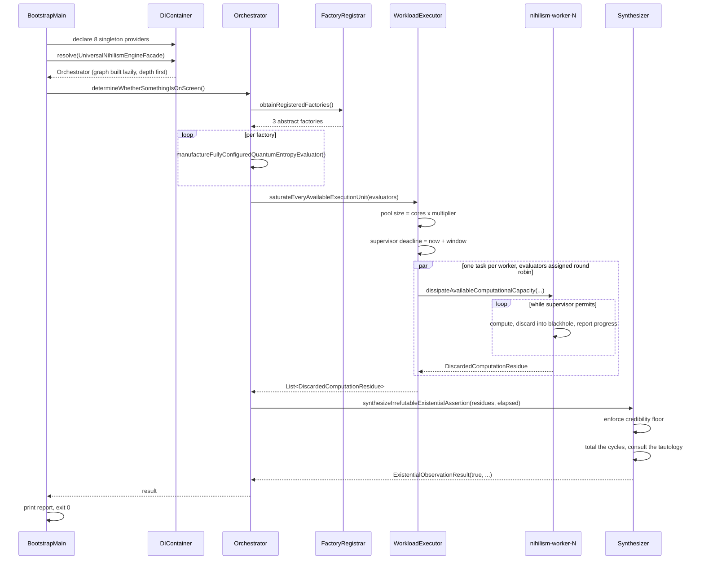

# Architecture Overview

This document describes how the Universal Nihilism Engine is put together and why each piece
exists. Decisions with alternatives worth recording live in [ADRs](adr/README.md); this document
describes the resulting structure.

## Layering

The codebase is organised into ten packages with a strict dependency direction. Nothing in `api`
or `spi` depends on anything that implements it.

```
                    ┌───────────────────────────────┐
                    │  UniversalNihilismEngine...    │  composition root
                    │  ApplicationBootstrapMain      │  (the only class that knows everything)
                    └───────────────┬───────────────┘
                                    │ declares bindings
                    ┌───────────────▼───────────────┐
                    │  container                     │  DI + enum singleton
                    └───────────────┬───────────────┘
                                    │ resolves
   ┌────────────────────────────────▼────────────────────────────────┐
   │  orchestration                                                   │
   │  NihilismEngineOrchestrator                                      │
   │  ThermodynamicallyIrreversibleWorkloadExecutor                   │
   │  DeadlineDrivenFutilityContinuationSupervisor                    │
   └──────┬──────────────────────┬──────────────────────┬────────────┘
          │                      │                      │
   ┌──────▼──────┐        ┌──────▼──────┐        ┌──────▼──────┐
   │  factory    │        │  strategy   │        │  synthesis  │
   └──────┬──────┘        └──────┬──────┘        └──────┬──────┘
          │                      │                      │
          └──────────────────────▼──────────────────────┘
                    ┌───────────────────────────────┐
                    │  spi  +  api  +  observer      │  contracts only
                    │  configuration  +  exception   │  values only
                    └───────────────────────────────┘
```

`api` and `spi` are deliberately separate. `api` is what a consumer of this platform imports:
one interface and one record. `spi` is what an extender of this platform implements: the strategy
contract, the synthesizer contract, the supervisor contract, and the residue record they exchange.
A consumer never needs to see the SPI, and an extender never needs to touch the API.

## Runtime sequence



## Component responsibilities

### `api`

| Type | Responsibility |
| --- | --- |
| `UniversalNihilismEngineFacade` | The single public entry point. One method that matters. |
| `ExistentialObservationResult` | Immutable record carrying the verdict plus three cost metrics. |

### `configuration`

`ComputationalWorkloadDescriptor` is immutable, built through a validating builder, and passed by
reference to every component that needs sizing information. `EngineConfigurationSourceResolver`
reads JVM system properties and translates parse failures into
`IrreconcilableOntologicalStateException`. There is exactly one configuration source, on purpose:
each additional source is another place the truth could differ.

### `container`

`MinimalistDependencyInjectionContainer` maps `Class<T>` to `Supplier<? extends T>`, caches one
instance per contract, and resolves reentrantly so providers can pull their own collaborators. All
public methods are `synchronized`; reentrancy on the same thread is safe because intrinsic locks
are reentrant.

`GlobalNihilismContextHolder` is a single element enum. Installation is once per JVM; a second
installation raises rather than overwrites.

### `exception`

Five concrete exceptions under one abstract root, all unchecked, each carrying a severity tier.
See [ADR-0007](adr/0007-unchecked-exception-hierarchy-with-severity-classification.md).

### `factory`

`AbstractQuantumEntropyEvaluatorFactory` defines two protected primitives and one `final` public
template method. Three concrete subclasses vary the strategy while sharing a synthesizer.
`QuantumEntropyEvaluatorFactoryRegistrar` wraps the factory list in a nameable type so the DI
container, which keys on `Class`, can hold it despite erasure.

### `observer`

`ComputationalProgressBroadcastingSubject` holds a `CopyOnWriteArrayList` of observers and
dispatches on the caller's thread. Observer exceptions are caught and logged rather than
propagated. Two observers ship: one prints rate limited telemetry, one accumulates counters using
`LongAdder` and an `AtomicLong` high water mark.

### `orchestration`

`ThermodynamicallyIrreversibleWorkloadExecutor` is the component that makes the machine hot. It
sizes a fixed pool to `availableProcessors() * multiplier`, builds one `Callable` per worker with
evaluators assigned round robin, and submits them through the timed `invokeAll` overload so that a
worker which overruns the window plus grace is cancelled rather than waited on forever. Cancelled
futures are counted and raise `MeaninglessComputationTimeoutException`.

`DeadlineDrivenFutilityContinuationSupervisor` is the only source of truth about when to stop. It
uses `System.nanoTime()` and the overflow safe `current - deadline < 0` comparison.

`NihilismEngineOrchestrator` holds three collaborators and calls them in order. It computes
nothing.

### `spi`

The pluggable contracts. `EntropyDissipationStrategy` carries an explicit implementation contract:
implementations must be immutable and must confine all mutable state to the method body, because a
single instance is invoked concurrently by every worker in the pool.

### `strategy`

Three CPU burners plus `JitCompilerDeceptionBlackhole`. The blackhole is the load bearing component
of the whole system; see [ADR-0005](adr/0005-jit-defeating-volatile-blackhole.md).

| Strategy | Work performed | Why it resists optimisation |
| --- | --- | --- |
| `DenseMatrixMultiplication...` | Naive cubic multiply of two 512x512 double matrices | Product buffer is written every cycle; trace is consumed by the blackhole |
| `RepeatedCryptographicDigest...` | 250 000 chained SHA-512 digests per cycle | Strictly sequential data dependency; digest N needs digest N-1 |
| `ExponentiallyNaiveFibonacci...` | Unmemoised tree recursion to ordinal 38 | Roughly 63 million calls; the JIT will inline some and still has to run them |

### `synthesis`

`DefaultExistentialAssertionSynthesizer` enforces the credibility floor, totals the cycles, and
delegates the verdict to `PhilosophicallyIrrefutableTautologyEvaluator`, whose reasoning is written
out in comments in the source and quoted in the final report.

## Concurrency model

- One fixed thread pool, sized to the visible core count times a multiplier.
- Daemon worker threads named `nihilism-worker-N`, so a thread dump during a run is legible.
- Cooperative cancellation only. Interruption is not used for control flow; see
  [ADR-0006](adr/0006-deadline-driven-cooperative-cancellation.md).
- Strategy instances are shared across threads and therefore immutable.
- The blackhole is shared and uses volatile writes. Concurrent writers overwrite each other, which
  is acceptable, because the values are worthless.
- Progress observers are invoked from every worker thread and must be thread safe. Both shipped
  observers are.

## What this system does not do

It opens no sockets. It reads no files. It writes no files. It spawns no processes. It installs
nothing, persists nothing, and has no third party runtime dependencies. It allocates heap
proportional to `cores x multiplier x matrix_dimension^2 x 8 bytes x 3` and releases it when the
process ends. The only resource it consumes aggressively is CPU time, and it consumes that
deliberately, for a bounded and configurable window.
